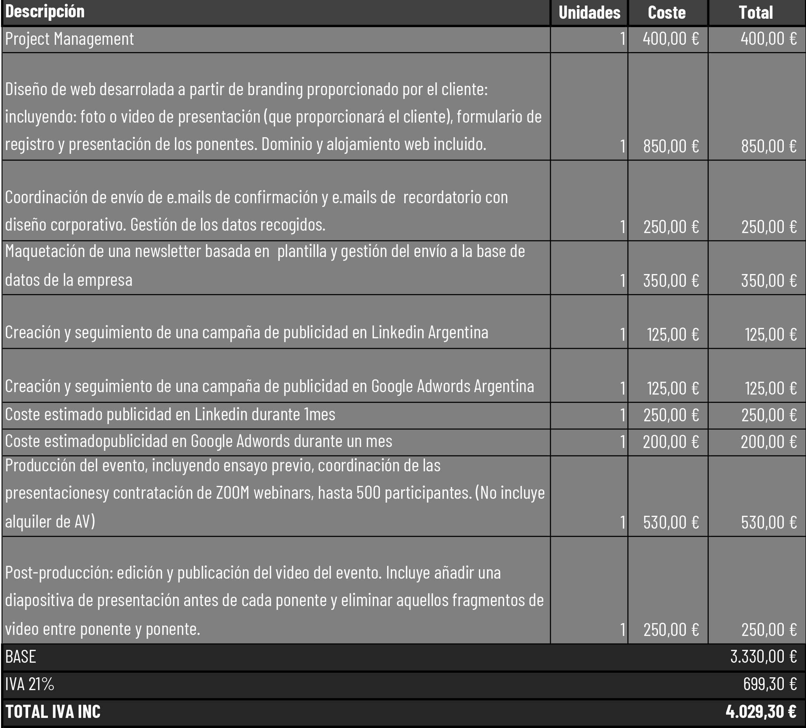

<style>

.precio{
background-color:#828282;
color: white;
padding: 10px;
font-style: italic;
}
</style>

<style>
.list-group-item.active, .list-group-item.active:focus, .list-group-item.active:hover {
    background-color: #EA5933;
}
</style>

<style>
.nav>li>a {
    position: relative;
    display: block;
    padding: 10px 15px;
    color: #EA5933;
    font-weight: bold;
}
.nav-pills>li.active>a, .nav-pills>li.active>a:hover, .nav-pills>li.active>a:focus {
    color: white;
    background-color: #EA5933;
}
</style>


<style>
.recuadro{
  border: 1px solid black;
  padding: 5px;
}
</style>
<br>


<script> 
    $(document).ready(function() { 
    $head = $('#header'); 
    $head.prepend('<A href = https://www.cuttevents.online></A>') 
    }); 
</script> 


```{r echo=FALSE, message=FALSE,warning=FALSE}
library(readxl)
library(dplyr)
library(knitr)
```


# Diseño web exclusiva


<div class="precio">
<p> Web exclusiva: 
  <ul>
* Creación  de la web de presentación del evento,  compuesta por dos páginas:
    
  * Incluirá un video o imagen de bienvenida, un formulario de inscripción y la información de contacto 
    
  * Incluirá la presentación de los ponentes.

* Dominio y alojamiento para la web del evento durante 3 meses

* La web incluirá el logo de la empresa y los colores corporativos.

</ul>
</p>
</div>

</br>
</br>


# Formulario de registro


<div class="precio">
<p> Formulario de registro: 
  <ul>
* Formulario de registro personalizado, incluyendo aquellos campos que sean necesarios.

* Una vez un participante se registra, le enviaremos por e.mail la confirmación de registro incluyendo el link al ZOOM del evento y un link con la posibilidad de incluir el evento en su calendario.

* Gestionaremos los datos recogidos, obtendremos un listado de contactos y todos los datos se recogerán en una hoja de excel y se os enviarán.

* Enviaremos e.mails de recordatorio el día anterior al evento incluyendo de nuevo el link ak ZOOM.

</ul>
</p>
</div>

</br>
</br>


# Marketing digital


<div class="precio">
<p> Marketing digital del evento: 
  <ul>
* Maquetación de una newsletter basada en plantilla y gestión del envío a la base de datos que ya tenga la empresa.

* Creación y seguimiento de una campaña de publicidad en Linkedin Argentina

* Creación y seguimiento de una campaña de Google Adwords en Argentina

</ul>
</p>
</div>

</br>
</br>

# Producción 


<div class="precio">
<p> Producción del evento: 
  <ul>
* Ensayo general previo al evento con los ponentes.

* Creación de fondo de pantalla de ZOOM personalizado, incluyendo el logo de la empresa y colores corporativos.

* Contratación del pack de webinar de ZOOM de hasta 500 participantes, incluyendo Q&A, chat, encuestas y entradas diferenciadas de diferentes roles: ponentes y asistentes.

* Coordinación de las presentaciones de los ponentes y de la interacción con los asistentes durante el evento.

</ul>
</p>
</div>


</br>
</br>

# Post-evento 


<div class="precio">
<p> Post-evento: 
  <ul>
* Edición y publicación del video del evento en la web y envío del original y el editado al cliente.

* Publicación de la documentación que nos envíen los ponentes.

</ul>
</p>
</div>
</br>
</br>


# Presupuesto





## Notas Importantes

<div class="precio">
<p> 
  <ul>
* nota 1

* nota 2

</ul>
</p>
</div>
</br>
</br>


  

<a href="https://www.cuttevents.online/contacto">Contacta con nosotros para más información.</a>
  
*****


